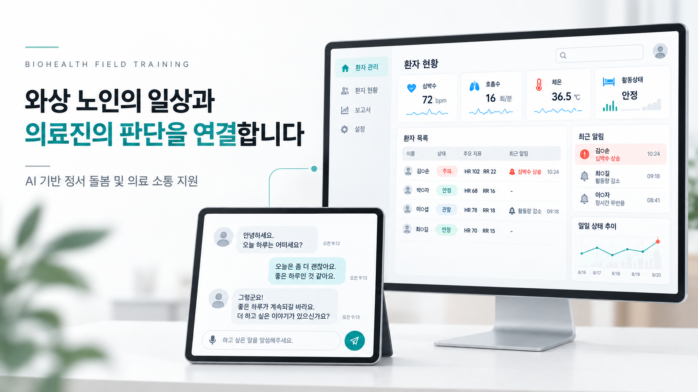

# BioHealth Field Training

### AI Emotional Care & Medical Communication Support

요양시설 와상 노인의 정서 돌봄과 의료진-환자 소통을 지원하는 AI 기반 헬스케어 서비스



---

## 프로젝트 소개

**BioHealth Field Training**은 요양시설에서 장기간 침상 생활을 하는 고령자를 위한 AI 기반 정서 돌봄 및 의료 소통 지원 프로젝트입니다.

와상 노인은 이동과 의사 표현에 제약이 있어 정서적 고립, 인지 저하, 증상 전달의 어려움을 겪을 수 있습니다. 의료진 역시 환자의 일상 대화와 생체신호, 수면 상태, 움직임 변화를 지속적으로 확인하고 기록하기 어렵습니다.

본 프로젝트는 AI 챗봇과 생체신호·카메라 데이터를 활용하여 다음 과정을 지원합니다.

- 환자의 일상적인 정서 교류
- 주관적 증상과 객관적 상태 정보 수집
- 의료진 검토용 SOAP 기록 초안 생성
- 환자가 이해하기 쉬운 의료 설명 제공
- 환자와 의료진 간 양방향 소통 지원

---

## 주요 사용자

| 사용자 | 주요 요구사항 |
| --- | --- |
| 요양시설 와상 노인 | 정서적 교류, 증상 표현, 쉬운 의료 설명 |
| 의료진 | 환자 상태 요약, SOAP 기록 지원, 위험 상황 확인 |
| 돌봄 인력 | 복약·자세·이상 행동 확인 및 알림 |
| 한국·일본 사용자 | 한국어·일본어 기반 의사소통 |

---

## 핵심 기능

### AI 정서 대화

AI 챗봇이 환자와 일상적인 대화를 진행하고 정서적 교류와 인지 자극을 제공합니다.

- 일상 대화 및 정서 지원
- 기분, 수면, 식사 상태 확인
- 통증 위치와 강도 확인
- 음성 인식 및 음성 안내
- 한국어·일본어 대화 지원

### 주관적 증상 수집

대화 과정에서 환자가 직접 표현한 정보를 수집하고 구조화합니다.

- 통증 정도와 위치
- 기분과 불안 상태
- 수면 상태
- 식사 및 식욕
- 일상생활의 불편 사항
- NRS 기반 통증 강도

### 객관적 정보 수집

센서와 카메라를 활용하여 환자의 객관적인 상태 정보를 수집합니다.

- 맥박
- 산소포화도
- 심전도
- 표정 및 감정 변화
- 자세와 움직임
- 수면 중 뒤척임
- 낙상 또는 이상 자세

### SOAP 기록 지원

수집한 정보를 SOAP 형식으로 정리하여 의료진에게 제공합니다.

| 항목 | 수집·생성 내용 |
| --- | --- |
| Subjective | 환자가 대화를 통해 표현한 증상과 불편 사항 |
| Objective | 생체신호, 표정, 자세 및 움직임 정보 |
| Assessment | 수집 정보에 기반한 AI 평가 초안과 판단 근거 |
| Plan | 의료진이 검토할 관리 및 치료 계획 초안 |

### 의료진 모니터링

의료진이 여러 환자의 상태를 효율적으로 확인할 수 있도록 지원합니다.

- 환자별 대화 및 상태 요약
- 생체신호 모니터링
- 주요 상태 변화 표시
- 낙상 및 이상 자세 알림
- 우울 위험 신호 확인
- SOAP 기록 초안 검토
- AI 분석 근거 확인

### 환자 맞춤형 의료 설명

의료진이 작성한 환자 상태와 치료 계획을 환자가 이해하기 쉬운 표현으로 변환합니다.

- 질환 및 현재 상태 설명
- 치료 계획의 쉬운 표현 제공
- 복약 시간 및 복용 정보 안내
- 한국어·일본어 번역 지원

---

## 서비스 흐름

```text
[1] AI 챗봇과 환자 대화
          ↓
[2] 주관적 증상(S) 수집
          +
[3] 생체신호·카메라 정보(O) 수집
          ↓
[4] AI 분석 및 SOAP 초안 생성
          ↓
[5] 의료진 검토 및 수정
          ↓
[6] 환자에게 쉬운 표현으로 전달
```

---

## 시스템 구성

```text
환자용 인터페이스
    ├─ AI 일상 대화
    ├─ 음성 인식 및 음성 안내
    ├─ 증상·기분·수면 정보 수집
    └─ 의료진 호출 및 복약 알림
                  ↓
            데이터 통합
    ├─ 대화 기반 주관적 정보
    ├─ 생체신호 기반 객관적 정보
    └─ 카메라 기반 표정·자세 정보
                  ↓
             AI 분석 모듈
    ├─ 정보 구조화
    ├─ SOAP 초안 생성
    ├─ 판단 근거 제공
    └─ 환자용 쉬운 설명 생성
                  ↓
           의료진용 대시보드
    ├─ 환자 현황 확인
    ├─ 위험 알림 확인
    ├─ SOAP 초안 검토
    └─ 최종 판단 및 설명 전달
```

---

## 차별화 포인트

### 정서 돌봄과 의료 소통의 연결

일반적인 말벗형 챗봇과 달리 대화 내용을 환자 상태 파악과 의료진 소통에 활용합니다.

### 멀티모달 환자 상태 분석

대화, 생체신호, 표정, 자세와 움직임을 결합하여 환자 상태를 종합적으로 확인합니다.

### 판단 근거 제공

AI가 생성한 평가와 계획뿐만 아니라 분석에 활용한 대화와 측정 정보도 함께 제공합니다.

### 양방향 의료 소통

환자의 정보를 의료진에게 전달하는 것에 그치지 않고, 의료진의 설명을 환자가 이해하기 쉬운 표현으로 다시 제공합니다.

### 한국어·일본어 지원

한국과 일본의 요양시설 환경을 고려한 다국어 의사소통을 지원합니다.

---

## MVP 개발 범위

| 구분 | 개발 내용 |
| --- | --- |
| AI 챗봇 | 일상 대화, 증상 문진, 주관적 정보 수집 |
| 음성 기능 | STT 기반 음성 인식 및 TTS 안내 |
| 카메라 모듈 | 표정, 자세, 움직임 변화 확인 |
| 생체신호 | 맥박, 산소포화도, 심전도 정보 연동 |
| SOAP 지원 | S·O 정보 구조화 및 A·P 초안 생성 |
| 환자 화면 | 대화, 의료진 호출, 복약 알림, 쉬운 설명 |
| 의료진 화면 | 환자 현황, 위험 알림, SOAP 검토 |
| 다국어 | 한국어·일본어 의사소통 지원 |

---

## 기술 구성

### AI 및 자연어 처리

- 대화형 AI
- 프롬프트 기반 증상 문진
- SOAP 기록 초안 생성
- 의료 정보 쉬운 표현 변환
- 한국어·일본어 처리

### 음성 처리

- Speech-to-Text
- Text-to-Speech
- 고령자 음성 인식 보조
- 가족 음성 활용 기능

### 카메라 및 행동 분석

- 얼굴 표정 분석
- 자세 및 움직임 추적
- 이상 자세 확인
- 낙상 위험 알림
- 복약 여부 확인

### 생체 데이터

- 맥박
- 산소포화도
- 심전도
- 수면 및 움직임 정보

---

## 기대 효과

### 환자 측면

- 일상 대화를 통한 정서적 고립 완화
- 자신의 증상과 불편함을 표현할 기회 확대
- 질환과 치료 계획에 대한 이해 향상
- 위험 상황의 조기 확인 가능성 향상

### 의료진 측면

- 환자의 일상 상태를 확인하는 시간 절감
- 대화와 측정 정보를 활용한 상태 파악 지원
- SOAP 기록 작성 업무 보조
- 환자 설명 및 의사소통 부담 완화

### 사회적 측면

- 초고령사회에서 증가하는 돌봄 인력 부담 완화
- 요양시설의 지속적인 환자 모니터링 지원
- 고령자 친화적인 디지털 헬스케어 환경 구축

---

## 개발 일정

| 기간 | 주요 내용 |
| --- | --- |
| 8월 말 | 프로젝트 기획 및 환자 페르소나 작성 |
| 9월 1~2주 | 데이터 수집 기준과 프롬프트 설계 |
| 9월 3~4주 | AI 챗봇 및 카메라 모듈 개발 |
| 일본 현지 활동 | 현지 요양 환경 조사, 시연 및 피드백 수집 |
| 귀국 후 | 기능 보완, 통합 테스트 및 결과 발표 |

---

## 팀 구성

| 이름 | 담당 역할 |
| --- | --- |
| 문채린 | 팀장, 서비스 기획, AI 챗봇 모델 개발 |
| 김도현 | 서비스 기획, 카메라 모듈 개발 |
| 박은채 | S·O 정보 수집 방안 조사 및 데이터 구성 |
| 정겨운 | 프롬프트 설계, 마케팅 및 사업화 기획 |
| 이주영 | 환자 페르소나 및 우울 위험 신호 기준 설계 |

---

## 프로젝트 진행 상태

현재 환자 시나리오를 기반으로 AI 챗봇, 카메라 모듈, 환자용 인터페이스와 의료진용 대시보드를 설계하고 있습니다.

향후 현지 요양 환경에서 서비스 흐름을 검증하고, 사용자 피드백을 반영하여 기능을 보완할 예정입니다.

---

## 주의사항

본 서비스가 제공하는 분석 결과와 우울 위험 신호는 의료 진단이 아닙니다.

AI가 생성한 평가와 치료 계획은 의료진의 검토와 최종 판단을 돕는 참고 정보로만 사용합니다.

---

## Vision

> 환자의 일상을 의료진의 판단과 연결하여, 더 세심하고 지속적인 돌봄을 지원합니다.
